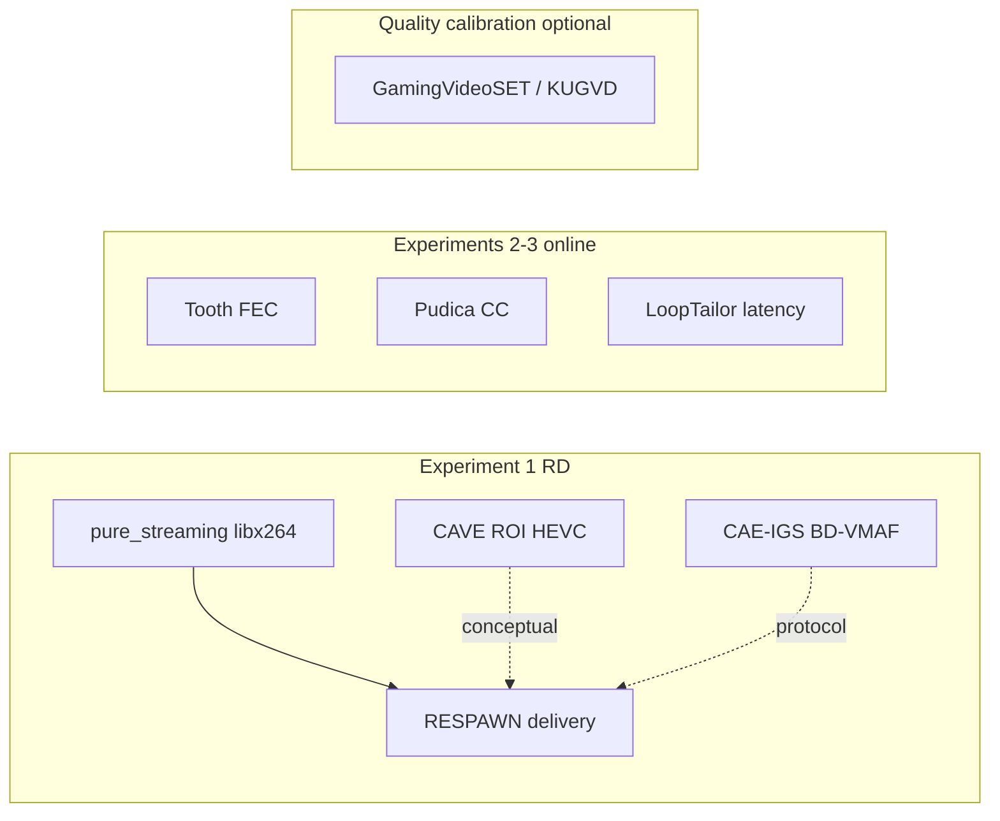

# Offline-First RESPAWN Evaluation Suite

This runbook covers the offline tranche of the experiment plan:

- duo-stream viability screen
- Experiment 1: bitrate-quality frontier
- Experiment 3: template/control overhead (photoreal cache sensitivity)
- Experiment 4: ablations
- Experiment 5: generality / failure modes
- **Experiment 2 (online pipeline): deferred** — not runnable in the current offline tranche

**Paper draft:** [`RESPAWN2026/offline_evaluation.tex`](RESPAWN2026/offline_evaluation.tex) — LaTeX `\section{Evaluation}` for Experiments 1, 3, 4, 5.

## Scope assumptions

- Learned-path offline experiments are normalized to `1920x1080` and `60 fps`.
- Mario / pixel-path clips keep their source aspect ratio, source resolution, and source FPS because the brick templates and stitching parameters are calibrated on the original pixel-video geometry.
- FC5 uses the cropped / zoomed-in path only in this phase.
- Full-frame FC5 is intentionally deferred.
- Experiment 1 is currently treated as a **theoretical bandwidth-saving upper bound**: the RESPAWN arm may mask from newly minted templates and does not require the current strict client-heal gate for FC5. Experiments 3 and 5 remain client-strategy-sensitive and must separately evaluate cache/pool/heal availability.
- `VMAF`, `SSIM`, and `PSNR` are computed whenever feasible.
- ROI quality uses the RESPAWN ROI sidecar (`msk1_payloads.bin`) as the region definition.
- ROI SSIM / PSNR are computed on the ROI crop. ROI VMAF uses a masked-video fallback so the metric remains available, but should be interpreted with more caution than full-frame VMAF.

## Common configurations

These defaults are shared across the offline writeup unless an experiment explicitly says otherwise.

### Input preparation

- FC5 Experiment 1 uses five shorter, non-overlapping `30s` chunks from `video/fc5_crop.mkv`, normalized to `1920x1080@60`. The source is only `3m39s`, so the earlier `~100s` windows were too long and risked overlap / duplicated content across FC5 records.
- FM6 Experiment 1 / 3 / 5 clips use the manifest-normalized `1920x1080@60` assets.
- Mario Experiment 1 / 3 / 5 clips use manifest-normalized source-geometry assets (`4:3`, source FPS) rather than stretched `1920x1080@60`; stretching to `16:9` distorted the brick template geometry and made the pixel path unreliable.
- Mario Experiment 1 now uses a merged target-block source from `/home/tiehangz/proj/datasets/pixel/supermario_720.mkv` intervals `00:12-00:17`, `00:25-00:40`, `01:15-01:55`, and `02:10-04:20`, split into five non-overlapping `~38s` clips. This replaces the earlier long/overlapping Mario windows that did not contain target blocks continuously.
- FC5 stays on the cropped / zoomed-in dataset for this phase.
- ROI metrics are always derived from the emitted `msk1_payloads.bin` sidecar of the run being evaluated.

### Learned-path defaults

- FM6 model: `deployment/yolov12n_racing_e300_split1.onnx`
- FC5 model: `deployment/yolov12n_fc5_seg_v1.onnx`
- FM6 latent bank: `experiments/encoder_eval/fm6_index_full_v1/dict/latent_bank.json`
- FC5 latent bank: `experiments/encoder_eval/fc5_crop_index_full_v1/dict/latent_bank.json`
- Matching mode: latent-key. For FC5 Experiment 1, use non-heal mode to measure an upper bound on content-removal bandwidth savings; for FM6 and client-reconstruction experiments, keep `--yolo-heal-only` until a separate strategy is selected.
- Shared motion thresholds: `latent-motion-iou=0.6`, `latent-motion-center=20`, `latent-motion-scale=0.25`, `latent-motion-boost=6`
- FC5 Experiment 1 upper-bound setting: `latent-thr=0.85`, no `--yolo-heal-only`.
- The previous strict-heal FC5 sweep (`yolo-heal-iou=0.999`, `yolo-heal-extra=0.01`) is retained as diagnostic evidence that the current heal-only implementation/parameters are too conservative for Exp1; it should be revisited under Experiment 3 / 5 client-cache work.
- FM6 keeps the prior default `latent-thr=0.86` until a separate FM6 stability sweep is run.
- Mask fill: `dominant` color, `fill-mode=solid`, `mask-color-period=200`, `feather-px=4`

### Pixel-path defaults

- Mario uses the single-template path in `experiments/encoder_eval/_pixel_single_template` (50×44 `brick_large_brown.png`)
- Mario forces native template scale with `pixel-force-scale=1.0`; the earlier stretched `1920x1080@60` Exp1 input auto-calibrated around `0.9`, which produced a visually wrong brick footprint and higher side-channel overhead on `mario_00`.
- Mario pixel-sweep winner (Exp1 refresh): `pixel-max-peaks=90`, `pixel-bootstrap=15`, `pixel-flow=1`, `pixel-adaptive-thr=1`, `pixel-thr-k=0.80`, plus grid header/snap and band scan (`pixel-band-pad-y=80`, `pixel-bands=4`).
- Mario encoder (matched pure + RESPAWN): `libx264`, `medium`, `tune=none`, `--enc-open-gop-defaults`.
- Mask fill: `dominant` color, `fill-mode=solid`, `mask-color-period=200`, `feather-px=0`

### FC5 mask profile (Exp1 refresh)

- Default upper-bound latent-key stack unchanged (`latent-thr=0.85`, non-heal, motion knobs, `feather-px=4`).
- Selectable mask profile via `--fc5-mask-profile`:
  - `global_period200`: global dominant color, `mask-color-period=200`
  - `local_pad64_mode`: per-region local dominant (`mask-color-local-pad=64`, `mask-color-local-per-region`, stat=`mode`) from gop_analysis full-clip winner

### Encoder defaults

- GOP: open (`--enc-open-gop-defaults`; x264 default keyint/scenecut, not locked 60)
- Preset: `medium` (all games in Exp1 refresh)
- Tune: `none`
- AUD: `1`
- Repeat headers: `1`
- Experiment 1 rate points: `8`, `12`, `16`, `20`, `24 Mbps` (fixed VBV; **not** CRF)
- For Experiment 1, the **pure streaming** reference and **RESPAWN** use the same rate control: `maxrate = target bitrate`, `bufsize = 2x target bitrate` (so gains are not from a looser cap on the reference).

## Main entry points

- Manifest builder: `tools/experiments/build_manifest.py`
- Duo screen: `tools/experiments/run_duo_screen.py`
- RD suite: `tools/experiments/run_rd_suite.py`
- Overhead analysis: `tools/experiments/analyze_overhead.py`
- Ablation suite: `tools/experiments/run_ablation_suite.py`
- Generality analysis: `tools/experiments/analyze_generality.py`
- End-to-end offline orchestrator: `tools/experiments/run_offline_suite.py`

## Typical workflow

```bash
python3 -m venv .venv-experiments
./.venv-experiments/bin/pip install opencv-python matplotlib numpy
./.venv-experiments/bin/python tools/experiments/build_manifest.py
./.venv-experiments/bin/python tools/experiments/run_duo_screen.py
./.venv-experiments/bin/python tools/experiments/run_rd_suite.py
./.venv-experiments/bin/python tools/experiments/analyze_overhead.py
./.venv-experiments/bin/python tools/experiments/run_ablation_suite.py
./.venv-experiments/bin/python tools/experiments/analyze_generality.py
```

Or run the offline tranche end-to-end:

```bash
./.venv-experiments/bin/python tools/experiments/run_offline_suite.py
```

## Expected outputs

- `record/RESPAWN2026/manifest/`
- `record/RESPAWN2026/duo_screen/`
- `record/RESPAWN2026/exp1/`
- `record/RESPAWN2026/exp3/`
- `record/RESPAWN2026/exp4/`
- `record/RESPAWN2026/exp5/`

## Evaluation

This section summarizes the **May 2026 unified Exp1 refresh** (15 clips, `medium` + open GOP + fixed VBV) and wraps Experiments 1, 3, 4, and 5. All numbers below come from [`record/RESPAWN2026/exp1/rd_suite_points.csv`](RESPAWN2026/exp1/rd_suite_points.csv) unless noted.

### Executive summary

- **Mario (pixel path)** is the clearest bandwidth win under fixed VBV: **+9.3% mean net delivered saving** across 25 points, rising to **+16.8% @ 20 Mbps** when the baseline spends more bits on brick detail.
- **FC5 (learned crop, non-heal upper bound)** sits at **break-even (~−0.01% net)**; video-only savings (+0.1% to +0.2%) are erased by MSK1 (~23 kbps).
- **FM6 (learned racing, heal-only)** also sits near **break-even (~−0.4% net)** under the refreshed encoder — unlike earlier `superfast`/locked-GOP runs that showed modest positive savings. Large reusable regions alone are not sufficient when VBV caps both arms equally.
- **Exp3 (photoreal)** and **Exp5** use uniform CRF23 intake ([`exp35_crf/`](RESPAWN2026/exp35_crf/)): FC5 **+6.2%**, FM6 **+14.1%** mean net BSP on learned path; Mario **+30.2%** in Exp5 only (pixel templates assumed pre-known — omitted from Exp3 cache/RTT curves).
- **Exp4** supports feather tuning, dominant-color fill, matching-strategy comparisons, and a CRF23 five-clip Mario path ablation.
- **Exp5** shows `avg_masked_area_pct` and `ref_ratio` predict *opportunity*, but **appearance variability** and sidecar overhead determine whether opportunity converts to net BSP.

### Experiment 1 — RD frontier

**Protocol:** [`record/RESPAWN2026/exp1/rd_suite_protocol.md`](RESPAWN2026/exp1/rd_suite_protocol.md). Reference arm is matched `pure_streaming` (libx264 only, no masking). RESPAWN quality is measured on `recovered_output.mp4`.

**Figures:**

- RD triptychs: [`figures/exp1_refresh/`](RESPAWN2026/figures/exp1_refresh/) (`exp1_vmaf_mean_rd_triptych.png`, SSIM, PSNR)
- LaTeX tables: `exp1_equal_quality_table.tex`, `exp1_fixed_budget_table.tex`
- FC5 deep-dive (shortclip A/B, same encoder): [`exp1_fc5_mask_ab/figures/fc5_sweep_savings_quality.png`](RESPAWN2026/exp1_fc5_mask_ab/figures/fc5_sweep_savings_quality.png)

**Mean net delivered saving (video + MSK1 vs pure), by game and rate:**

| Game | 8 Mbps | 16 Mbps | 20 Mbps | All rates (25 pts) |
| --- | ---: | ---: | ---: | ---: |
| FC5 | −0.21% | −0.05% | +0.09% | **−0.01%** |
| FM6 | −0.39% | −0.51% | −0.43% | **−0.43%** |
| Mario | −0.52% | +9.41% | +16.78% | **+9.29%** |

**Video-only vs MSK1 (FC5 @ 16 Mbps example):** video-only +0.09%, MSK1 0.023 Mbps → net ≈ 0%. FC5 mask profile decision: [`exp1_fc5_mask_ab/decision.md`](RESPAWN2026/exp1_fc5_mask_ab/decision.md) (`global_period200`).

**Recovered SSIM (mean across clips):** FC5 ~0.91, FM6 ~0.93, Mario ~0.91 at 16–20 Mbps — quality is preserved even where bandwidth gain is small.

**What Exp1 does not claim:**

- Not CRF/open-bitrate `gop_analysis` savings (those runs used a different rate-control regime).
- Not client-deployable FC5 policy (Exp1 FC5 is non-heal upper bound).
- Not equal-quality BD-rate wins for Mario/FM6 under this refresh (VMAF/SSIM tables in [`rd_summary.md`](RESPAWN2026/exp1/rd_summary.md) are sparse or misleading for photoreal games; cite fixed-budget net saving instead).

### Experiment 3 — Overhead and break-even (CRF / exploratory intake)

**Intake:** [`exp35_crf/exp35_points.csv`](RESPAWN2026/exp35_crf/exp35_points.csv) — 15 clip pairs, all **CRF 23 + open GOP**. Not the Exp1 VBV RD sweep.

**Scope:** Exp3 figures and cache/RTT narrative cover **photoreal learned path only (FC5, FM6)**. Mario is excluded — pixel-game templates are assumed **fully known before session start**; Mario CRF23 BSP appears in Exp5.

**Protocol notes:**

- FC5: `gop_analysis/fc5_XX_offline_open_x264_crf23`
- FM6: `gop_analysis/fm6_XX_offline_open_x264_crf23` (heal-only)

**Accounting model:**

```text
net_saved = baseline_delivered_bytes − respawn_video_bytes − MSK1_bytes − template_bytes
```

Template bytes use the **synthetic template-delay model** (auto-enabled when MSK1 lacks `region.path`). See [`exp3/exp3_interpretation_note.md`](RESPAWN2026/exp3/exp3_interpretation_note.md).

**Observed net BSP on CRF/exploratory intake (delivered video + RSEI, no synthetic penalty):**

| Game | Clips | Mean net BSP | Exp3 figures |
| --- | --- | ---: | --- |
| FM6 CRF23 heal-only | 5 | **+14.1%** | yes |
| FC5 CRF23 | 5 | **+6.2%** | yes |
| Mario CRF23 (pixel) | 5 | **+30.2%** | Exp5 only |

Example photoreal clips: `fc5_00` +8.9%, `fm6_04` +16.3%.

**Cache/RTT curves:** regenerated with RTT `{20, 80, 150}` ms and delay `{0, 2, 5}` RTT windows on FC5/FM6; curves are distinguishable under the synthetic model. Treat as **sensitivity analysis**, not measured client policy.

**Partial-warm FM6 check:** [`exp3/partial_warm_fm6_summary.csv`](RESPAWN2026/exp3/partial_warm_fm6_summary.csv) and [`exp3/partial_warm_fm6_table.tex`](RESPAWN2026/exp3/partial_warm_fm6_table.tex) summarize FM6 01--04 at CRF23. A popularity-ranked 10% preload cuts forced Raw from 37.1% to 9.3%; 50% preload reaches +12.83 MB mean net saved without assuming full-pool download.

**Figures:** `fc5_00_*` and `fm6_*` cumulative-net PNGs under [`exp3/`](RESPAWN2026/exp3/); summary CSV: `overhead_summary.csv`.

### Experiment 4 — Ablations (by reference)

Full report: [`exp4/experiment4_ablation_report.md`](RESPAWN2026/exp4/experiment4_ablation_report.md). No Exp1 rerun required — ablations are orthogonal to the May 2026 encoder refresh.

**Supported claims (current record):**

- **Feather width:** strongest single-knob result; wider feather reduces boundary artifacts at some BSP cost.
- **Dominant-color fill:** competitive with black fill on FC5 short traces; preferred default for learned path.
- **Mario path:** CRF23 five-clip ablation keeps the full pipeline aligned with the Exp5 +30.2% average; no-flow drops to +25.6%, while no-Kalman/template-only remain close in BSP and need quality/stability interpretation.

**Open / partial:**

- **Blur fill:** no saved run in repo (N/A in fill table).
- **Inpaint fill:** supported on `fc5_00` CRF23 open-x264 trace (−2.53% net BSP; quality up, bandwidth down vs dominant).
- Matching-strategy table is first-pass only (CRF18 `final3` protocol, not Exp1 VBV).

### Experiment 5 — Generality and failure modes (CRF / exploratory intake)

**Data:** [`exp35_crf/exp35_points.csv`](RESPAWN2026/exp35_crf/exp35_points.csv) → [`exp5/generality_summary.csv`](RESPAWN2026/exp5/generality_summary.csv). Notes: [`exp5/generality_notes.md`](RESPAWN2026/exp5/generality_notes.md). Exp1 VBV aggregate numbers below remain valid for RD claims.

**Mean BSP on CRF23 intake (15 clips, uniform encoder):** Mario **+30.2%**, FC5 **+6.2%**, FM6 **+14.1%**.

**Predictors:**

- `avg_masked_area_pct` correlates with opportunity; `ref_ratio` is informative for photoreal only (Mario pixel rows saturate at 1.0).
- `appearance_variability_roi` explains FC5 instability despite nontrivial masked area.

**Figures/tables:** [`exp5/bsp_vs_masked_area.png`](RESPAWN2026/exp5/bsp_vs_masked_area.png) (all clips, points only), [`exp5/bsp_vs_ref_ratio.tex`](RESPAWN2026/exp5/bsp_vs_ref_ratio.tex) / [`.md`](RESPAWN2026/exp5/bsp_vs_ref_ratio.md) (photoreal game-average table; Mario omitted), `per_gop_savings_cdf.png` (x-axis clipped to [-50%, +50%]).

**Recommended claim (conservative):**

> RESPAWN is strongest when recurring objects are large, stable, and reusable *and* the rate point leaves headroom for the baseline to spend bits on masked detail; when those conditions fail, the system falls back with modest quality impact and near-zero net harm.

### Limitations and deferred work

- **Client-heal / template pool:** Exp1 FC5 is non-heal upper bound; FM6 uses heal-only but still breaks even under VBV. Exp3 cache/delay needs real template IDs in MSK1.
- **Full-frame FC5:** deferred; crop-only results may not transfer.
- **Exp3/Exp5 intake:** CRF/open-GOP exploratory runs under [`exp35_crf/`](RESPAWN2026/exp35_crf/) — separate from Exp1 fixed-VBV RD.
- **Encoder regime:** Exp1 fixed VBV pegs both arms to the target; CRF/open-bitrate `gop_analysis` runs are not directly comparable to Exp1 RD numbers.
- **Experiment 2 (online):** deferred — live transport, latency, and stall evaluation not runnable offline; see [`offline_evaluation.tex`](RESPAWN2026/offline_evaluation.tex) § deferred online evaluation.
- **Duo-stream gate:** run separately; see duo-screen outputs under `duo_screen/`.

### Artifact index

| Experiment | Primary CSV / summary | Key figures | Interpretation doc |
| --- | --- | --- | --- |
| Exp1 | `exp1/rd_suite_points.csv`, `rd_summary.md` | `figures/exp1_refresh/*`, `exp1_fc5_mask_ab/figures/fc5_sweep_*.png` | `exp1/rd_suite_protocol.md`, `exp1_fc5_mask_ab/decision.md` |
| Exp3 | `exp3/overhead_summary.csv`, `exp3/partial_warm_fm6_summary.csv` | `exp3/*_cumulative_net_bytes.png`, `exp3/partial_warm_fm6_table.tex` | `exp3/exp3_interpretation_note.md`, intake: `exp35_crf/exp35_points.csv` |
| Exp4 | `exp4/mario_crf23_ablation/ablation_summary.csv`, legacy `record/fill`, `record/feather`, `record/final3` | `exp4/exp4_*_table.tex` | `exp4/experiment4_ablation_report.md` |
| Exp5 | `exp5/generality_summary.csv` | `exp5/bsp_vs_masked_area.png`, `bsp_vs_ref_ratio.tex`, `per_gop_savings_cdf.png` | `exp5/generality_notes.md`, `offline_experiments_slides.md`, intake: `exp35_crf/exp35_points.csv` |
| All (paper) | — | — | `offline_evaluation.tex` |

## Related work and benchmarks

This section calibrates expectations for the offline suite. Published work spans four layers; only the first two are fair **bitrate–quality** anchors for Experiment 1. NSDI/USENIX papers mostly cover transport, control, and QoE — use them for Experiments 2–3 and for writeup framing, not as RD numeric targets.

| Layer | Role in this suite | Primary references |
| --- | --- | --- |
| **Compression / RD** | Closest idea match; BD-rate / VMAF anchors | CAVE, CAE-IGS; our `pure_streaming` arm |
| **Gaming VQA datasets** | Calibrate VMAF/SSIM on gaming content; not end-to-end delivery | GamingVideoSET, KUGVD, LIVE-YT-Gaming, GameScope |
| **NSDI / USENIX systems** | Stalls, latency, FEC, ladders, neural resilience | Tooth, LoopTailor, Pudica, AFR, GRACE, ARTEMIS, Swift |
| **Measurement traces** | Realistic bitrates, codecs, congestion behavior | Claypool (Stadia/GFN/Luna), GFN anatomy, TGaming |



### Closest compression / RD comparators (not NSDI)

These are the fairest **published** anchors for content-aware cloud-gaming video. None reproduces RESPAWN’s template/side-channel delivery; treat numbers as directional.

- **[CAVE: Content-aware Video Encoding for Cloud Gaming](https://nmsl.cs.sfu.ca/index.php/Content-aware_Video_Encoding_for_Cloud_Gaming)** (MMSys 2019; [PDF](https://kdiab.ca/assets/pdf/pubs/mmsys19.pdf)) — Game-supplied ROIs drive uneven HEVC bit allocation on **GamingAnywhere** with no client changes. Reports **21–46%** bitrate savings vs baseline HEVC (and **12–89%** vs prior ROI work). Best **conceptual** match for learned-path ROI masking; encoder is HEVC, not libx264 template delivery.
- **[CAE-IGS: Content-adaptive encoding for interactive game streaming](https://arxiv.org/pdf/2511.22327)** — Per-scene resolution ladder from lightweight HEVC stats (no lookahead). On **1080p60** gaming content reports **~7% BD-rate (VMAF)**, **+2.3 VMAF** vs static ladder, and lower frame-drop rate. Closest published **BD-VMAF + interactive** protocol for Exp1 discussion.
- **In-suite primary baseline:** `pure_streaming` (matched libx264, same VBV/GOP/preset as RESPAWN) — see [Experiment 1 reference arm](#experiment-1-reference-arm-important) below. All RD claims should cite this protocol first.

### Gaming VQA datasets (quality calibration only)

Use when validating that `VMAF` / `SSIM` / subjective scores behave on **gaming** content. They do **not** benchmark template reuse, side channels, or wire-efficiency vs naive streaming.

| Dataset | Contents | Notes |
| --- | --- | --- |
| [GamingVideoSET](https://eprints.kingston.ac.uk/id/eprint/41300/) (NetGames 2018) | 24 ref clips; H.264 sweeps; subjective MOS | Foundational gaming-streaming VQA set |
| [KUGVD](https://www.colorado.edu/lab/live/home/publications/Subjective_Quality_Assessment_of_User-Generated_Content_Gaming_Videos) | Extends GamingVideoSET; 6 games, lab MOS | Same codec grid, different display setup |
| LIVE-YT-Gaming | 600 UGC clips, online MOS | UGC distortions, not PGC encode sweeps |
| [GameScope](https://arxiv.org/html/2605.01272) | Multi-codec (H.264/H.265/AV1), multi-attribute MOS | **VQA benchmark**, not NSDI cloud-gaming compression. Do not confuse with Valve **gamescope** (local compositor) or NSDI **Pudica** (congestion control). |

Optional: [GamingHDRVideoSET](https://github.com/NabajeetBarman/GamingHDRVideoSET) for HDR/10-bit sweeps if the writeup extends beyond SDR Exp1.

### Closest conceptual inspiration (NSDI)

- [Region-based Content Enhancement for Efficient Video Analytics at the Edge (NSDI 2025)](https://www.usenix.org/conference/nsdi25/presentation/wang-weijun) — RegenHance: **10–19%** task accuracy, **2–3×** throughput vs full-frame enhancement via region-selective processing. Strong systems argument for sparse ROIs; **not** an Exp1 RD comparator (analytics, not gaming encode curves).

### NSDI / USENIX systems comparators (QoE, latency, bandwidth)

Use for **online** framing (Experiments 2–3) and related-work positioning. These papers rarely report matched `BD-rate` / ROI metrics under the same encoder as Exp1.

| Paper | Venue | Reported gains (directional) |
| --- | --- | --- |
| [Tooth](https://www.usenix.org/conference/nsdi25/presentation/an) | NSDI 2025 | Cloud-gaming FEC: **11.4–29.2%** bitrate, **40.2–85.2%** stall reduction, **54.9–75.0%** redundancy cost |
| [LoopTailor](https://www.usenix.org/conference/nsdi25/presentation/li-yang) | NSDI 2025 | Mobile cloud gaming input-to-display **112–403 ms** → ~**34%** reduction, stable under **100 ms** |
| [Pudica](https://www.usenix.org/conference/nsdi24/presentation/wang-shibo) | NSDI 2024 | CC: **3.1× / 4.9×** frame delay, **10.3×** stalls, **+12.1%** frame bitrate |
| [AFR](https://www.usenix.org/conference/nsdi23/presentation/meng) | NSDI 2023 | RTC: **7.4×** tail queuing delay, **34%** fewer stutters (production) |
| [GRACE](https://www.usenix.org/conference/nsdi24/presentation/cheng) | NSDI 2024 | Neural codec under loss: **95%** fewer undecodable frames, **90%** shorter stalls, **+38%** MOS |
| [ARTEMIS](https://www.usenix.org/conference/nsdi24/presentation/tashtarian) | NSDI 2024 | Content-adaptive ladder: **11%** QoE, **18%** latency, **25%** encode compute |
| [Swift](https://www.usenix.org/conference/nsdi22/presentation/dasari) | NSDI 2022 | Neural layered streaming: **45%** QoE, **16%** bandwidth (FCC traces) |

### Measurement traces and commercial streaming behavior

Use to justify rate points, stall semantics, and “what GeForce Now–class services do” — not as algorithmic baselines to reproduce offline.

- [Claypool et al., IMC 2022 / NOSSDAV 2022](https://web.cs.wpi.edu/~claypool/papers/game-stream-imc-22/paper.pdf) — Stadia, GeForce Now, Luna under capacity limits and competing TCP (Cubic/BBR): bitrate fairness, reaction time, shared-bottleneck behavior.
- [Network anatomy of GeForce NOW](https://arxiv.org/html/2401.06366v2) — PCAP traces across desktop/mobile/browser; resolution/fps grids; flow classification (video vs input).
- [Network analysis: Stadia, GeForce Now, PSNow](https://arxiv.org/abs/2012.06774) — Median bitrates (~15 Mbps @720p, ~20 Mbps @1080p for GFN), dynamic H.264 parameter adaptation under congestion.
- [TGaming + NG-Scope5G](https://arxiv.org/html/2402.04454v1) — 5G telemetry-driven frame scheduler and encoding adaptation at the gaming server.

### How to use benchmarks in this suite

- **Experiment 1 (bitrate–quality frontier):** Compare against **`pure_streaming`** first. Cite **CAVE** for ROI/bit-allocation precedent (**21–46%** savings) and **CAE-IGS** for interactive **BD-VMAF** reporting. Expect **content dependence**: strong gains when templates/regions are large, stable, and reusable (Mario bricks, FC5 crop); weak or mixed when reuse is poor or pixel fidelity is strict. No NSDI paper gives a single Exp1 target for template/side-channel delivery. If VMAF improves while SSIM/PSNR lag, inspect mask boundaries and ROI metric protocol before treating as failure.
- **Experiment 2 (online pipeline):** Tooth, LoopTailor, Pudica, AFR — latency, queue buildup, stalls, and deadline misses are first-class. Win condition: same or better delivered quality **without** worse tail delay or stalls, not bytes alone.
- **Experiment 3 (net gain after overheads):** Tooth — redundancy/control overhead can erase nominal savings. Report cold-start template bytes, cache misses, side-channel cost, and break-even time explicitly.
- **Experiment 4 (ablations):** No direct external benchmark; use Exp1 protocol consistency across knobs.
- **Experiment 5 (generality / failure modes):** RegenHance + CAVE — region selectivity helps when important content is **sparse and predictable**. Flag clips where motion, heal policy, or template scale breaks recovery.
- **Optional VQA cross-check:** Run a small GamingVideoSET/KUGVD-style encode grid on one FM6/FC5 clip to confirm gaming VMAF/SSIM trends match full-frame Exp1 curves (not required for suite completion).

### Cautions for comparison

- **Layer mismatch:** Most NSDI citations optimize FEC, CC, frame rate, ladders, or neural loss resilience — not mask/template delivery at matched libx264.
- **GameScope / gamescope / Pudica:** Three different things (VQA dataset vs SteamOS compositor vs NSDI congestion control).
- **Numeric claims:** Treat published percentages as **directional context** unless reproduced under our manifest, encoder defaults, and rate points above.
- **Generality:** Public gaming datasets emphasize PGC/UGC **encode** quality; RESPAWN clips (`record/RESPAWN2026/manifest/`) remain the main test of template reuse across FM6, FC5, and Mario geometry.

## Notes

- The duo-screen should be treated as a gating step. If `mean_run_length_ref_raw_states` is close to `1` or `2`, the dual-substream idea is likely not worth deeper investment.

### Experiment 1 reference arm (important)

- **RD / Exp1 compares RESPAWN against pure streaming, not a second YOLO variant.** Under `record/.../exp1/<clip>/<rate>/pure_streaming/`, the reference is **only** a **matched libx264 encode** of the normalized source (same target bitrate, GOP, preset, tune, scenecut, AUD, repeat-headers, maxrate, bufsize as the offline sweep). There is **no** segmentation, masking, template reuse, or side channel—`original_output.mp4`, `segmented_output.mp4`, and `recovered_output.mp4` are identical copies of that encode. This isolates gains from **content-based delivery** vs **naive streaming at the same encoder configuration**.
- **`respawn_hysteresis/`** is the RESPAWN offline path with the matched encoder as in `run_rd_suite.py`. For the current Exp1 rerun, FC5 uses non-heal latent-key mode to estimate an upper bound on bandwidth saving; this is not yet the final client-deployable heal policy.
- To reproduce the **old** A/B (YOLO current-baseline binary vs RESPAWN), run `tools/experiments/run_rd_suite.py` with **`--legacy-yolo-baseline`** (outputs under `baseline_current/` and CSV `variant` = `baseline`).

### Experiment 3 / 5 client-heal note

- Exp3 and Exp5 should not inherit the Exp1 non-heal assumption blindly. Their central question is whether a thin client with a finite template/cache pool can reconstruct masked regions on time.
- The strict `--yolo-heal-only` trials are therefore still useful: they show that the current client-availability gate can collapse FC5 masking to raw mode and needs better pool warming, template shipping, fallback, or gating before being used as the main deployable policy.

- Mario source material is currently lower-resolution / lower-fps than the learned games. The manifest layer records that normalization explicitly so plots and later writeups can disclose it cleanly.
